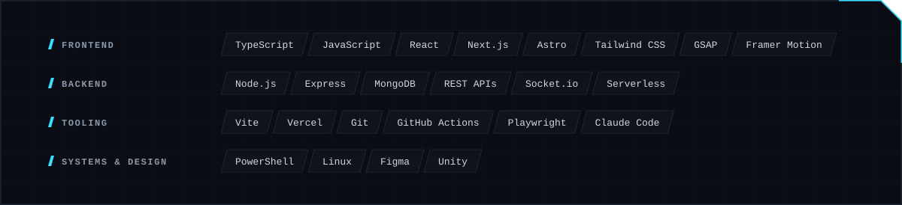

  

  
  
<!-- LATEST:START -->
  
<!-- LATEST:END -->

 

  <b>Telecommunications engineer and web developer.</b> 
  I design and ship fast, polished websites and web apps, 
  from client landing pages to full-stack products and dev tools.

 

## Selected work

<!-- PROJECTS:START -->
<!-- Generated from your pinned repos by scripts/build-assets.mjs — edit projects.config.json, not this block. -->

  
  
  
  
  
  

<!-- PROJECTS:END -->

 

  

## Toolbox

  

 

  

